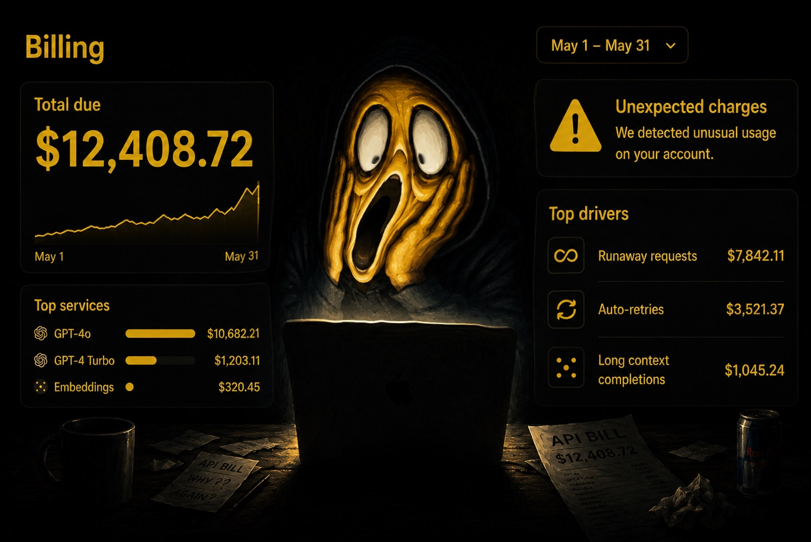

<p align="center">
  
</p>

<h1 align="center">😱 NoWayAgent</h1>

<p align="center">
Bills. Hallucinations. Production accidents.
</p>

<p align="center">
<b>Your AI did WHAT?</b>
</p>

<p align="center">
Real AI agent disasters.
</p>

—

## 😱 What is NoWayAgent?

NoWayAgent is an open repository of **real AI agent disasters**.

Unexpected API bills.

Hallucinations.

Prompt injections.

Infinite loops.

Production incidents.

Data leaks.

Tool misuse.

The goal is simple:

> **Learn from disasters before repeating them.**

Because everyone is moving fast.

And someone is definitely shipping an agent directly to production.

—

## 🚧 Status

Repository under construction.

Incidents are currently being collected.

—

## 📁 Repository Structure

```txt
incidents/
└── 2026/

templates/
└── incident-template.md

.github/
└── PULL_REQUEST_TEMPLATE.md
